# mysuite

[](https://github.com/fsgiven/mysuite/actions/workflows/ci.yml) [](LICENSE)

A free, local toolkit for repetitive image and design-asset work — a command-line suite plus an
interactive terminal dashboard. Everything runs on your own machine: no uploads, no accounts, no
telemetry.

> **Early release.** mysuite works on the machine it was built on, but not everything is tested, and
> only macOS has been tried. See [Status](#status-what-is-and-isnt-tested) for exactly what is and isn't.

<p align="center">
  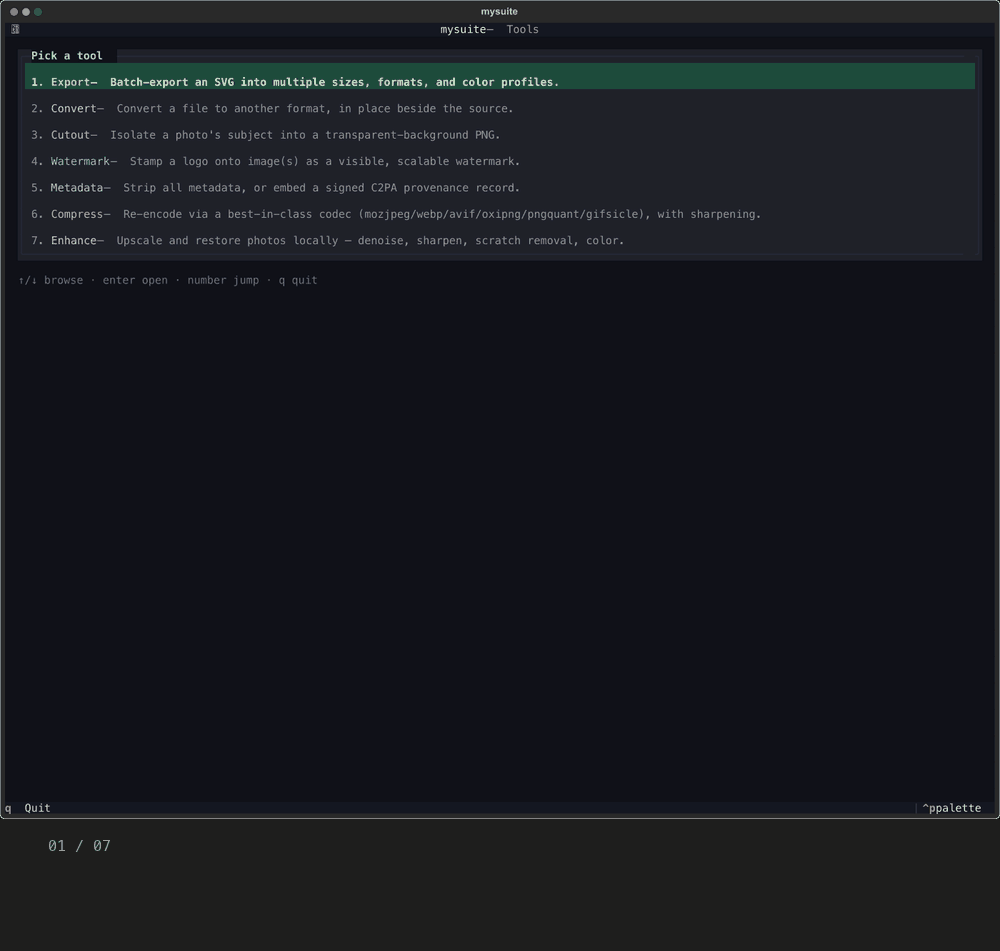
</p>
<p align="center"><sub>A real session in the terminal dashboard (<code>mysuite tui</code>), on synthetic demo images.</sub></p>

| Tool | What it does |
| --- | --- |
| `export` | One SVG → many sizes, formats (PNG/PDF/EPS/SVG/JPEG/WebP/TIFF/ICO/ICNS) and color profiles, with presets, recoloring and naming templates |
| `convert` | Convert files between formats, in place beside the source |
| `cutout` | Isolate a photo's subject onto a transparent background (macOS Vision) |
| `watermark` | Stamp a logo onto images as a visible, scalable overlay |
| `metadata` | **strip** all metadata, **randomize** it into a plausible decoy camera, or **credit** with a C2PA provenance record |
| `enhance` | Upscale and restore photos locally: denoise, sharpen, scratch removal, color, optional AI backend |
| `compress` | Re-encode with the same best-in-class codecs Squoosh uses (mozjpeg, WebP, AVIF, oxipng, pngquant, gifsicle), plus sharpening |
| `transform` | Quick edits: trim, crop (box or aspect), rotate, flip, resize, pad, round corners, background — in a fixed, predictable order |
| `inspect` | Facts about a file (size, colour mode, transparency, palette, sharpness, GPS…) as numbers — for agents and humans |
| `pipeline` | Several tools in one declarative file (export → metadata → compress…) |
| `mcp` | An MCP server so Claude Desktop, Cursor, Claude Code or a local-model client can drive all of this |

Outputs are always written **beside the source** with a suffix (`_cutout`, `_stripped`, `_compressed`,
...). mysuite never overwrites without `--overwrite` and never modifies your original.

Developed and tested on macOS (Apple Silicon, Homebrew). `cutout` and `icns` export are macOS-only (`enhance` is plain Python and has no such limit).
The rest wraps standard command-line tools, so it should work elsewhere, but that's untested.

`mysuite tui` opens the dashboard: a front page (a suitcase mascot in a top hat, with tips), then the tool overview; press any key to continue.

**Using it from an AI agent?** Every command has `--json`, there is a sandbox, a pipeline format and an MCP server. Start with [AGENTS.md](AGENTS.md) (rules, which command to use, tested examples) and [docs/agents/COMMANDS.md](docs/agents/COMMANDS.md).

## Status: what is and isn't tested

mysuite is a young personal project, released as-is. Please read this before relying on it.

| Tool | Automated tests | Known problems |
| --- | --- | --- |
| `export` | Yes: every format and colourspace, CMYK values read back from the PDF, the recolor matrix, unusual and hostile SVGs, naming and path safety | CMYK numbers come from an ICC profile, so they are only as good as that profile: the default is Ghostscript's SWOP-like one, not your printer's (pass `--cmyk-profile`). Gradients and images are converted by Ghostscript, not rewritten to `clean` values (and the export says so). Spot colours (Pantone) are not supported |
| `convert` | Yes: the full source × target matrix and edge cases | single-frame targets keep only the first page/frame (and say so) |
| `watermark` | Yes: all 9 positions, opacity, scale, SVG logos | none known |
| `cutout` | Yes (needs the macOS helper, so skipped on CI): real Vision runs | Vision is probabilistic: it sometimes picks the wrong subject (an empty result is now reported as a failure) |
| `metadata` | Yes: strip, randomize and **credit** (embed and read back as JPG/PNG/WebP/TIFF) | `credit` uses c2patool's built-in *test* certificate |
| `compress` | Yes: all six codecs, presets, odd colour modes | none known |
| `enhance` | Yes: pipeline, scratch removal, presets, CLI, TUI | the optional AI backend has **never been run with real model weights**; 16-bit sources become 8-bit (now reported) |
| `transform` | Yes: every operation checked on pixels (resize modes, crop, trim, rotate, flip, pad, round, flatten), fixed order, EXIF handling, safety | no preview exists in a terminal, so judge the result by opening the file; animated sources keep only the first frame (and say so) |
| `inspect` | Yes: CMYK/alpha/gray, EXIF orientation/GPS/serial, blank/blurry, multipage, SVG facts, thumbnails | the "blurry" flag is a heuristic (variance of the Laplacian), not a verdict |
| `--json`, sandbox, `pipeline`, `mcp` | Yes: one JSON document on stdout, exit codes 0–4, escape attempts (`..`, absolute paths, symlinks), pipelines end to end, the MCP server through a real MCP client | the sandbox is off unless you ask for it (the MCP server always uses it); pipelines are unproven beyond the examples; MCP tested with the Python SDK, **not yet with Claude Desktop or Cursor** |
| Terminal dashboard | Yes for all screens except the file-picker edge cases | Drag-and-drop depends on your terminal emulator |

All 22 findings from the first test pass are fixed and the suite has no expected failures. Details are in
[docs/TEST-FINDINGS.md](docs/TEST-FINDINGS.md).

**What was run on:** one machine, macOS 26 (Apple Silicon), Homebrew, Python 3.11, with ImageMagick
7.1.2, exiftool 13.55, c2patool 0.27.15, Ghostscript 10.07, librsvg 2.62, mozjpeg 4.1.5, libwebp 1.6,
libavif 1.4, oxipng 10.2, pngquant 3.0, gifsicle 1.96. The automated suite also runs on every push on a clean
GitHub macOS runner ([CI](.github/workflows/ci.yml)), where all of it passes with nothing skipped.

**Not tested at all:** Linux, Windows, Intel Macs, macOS older than 14 (`cutout`), other Python
versions, other terminal emulators, very large or unusual inputs (CMYK or 16-bit sources into
`enhance`, animated GIFs, HEIC, which isn't supported), and any tool version other than those listed.
Treat the CLI as more reliable than the dashboard, and run anything important on a copy first. mysuite
never changes your originals, but it can still produce a wrong *output*.

Found a problem? Please open an issue with the exact command, the file type and your tool versions
(`mysuite doctor` prints them).

## Screens

Real screenshots of the dashboard, run on synthetic images (a generated sunset harbour, a generated
damaged "old scan" and a generated logo). File paths are shown as `~/…`.

| | |
| --- | --- |
| 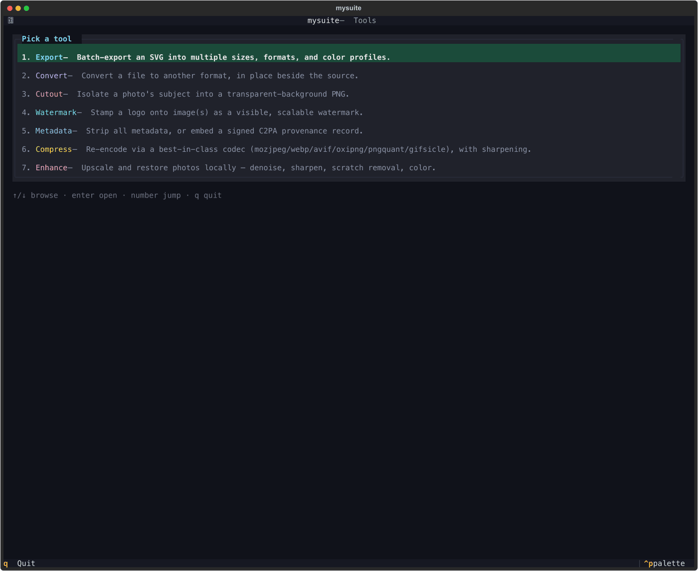<br>**Home** — pick a tool with a number key | 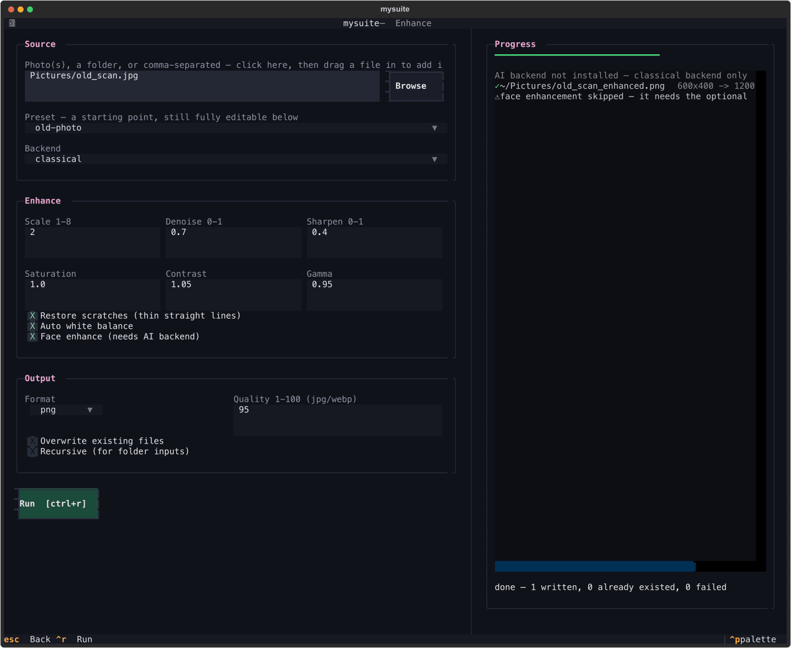<br>**Enhance** — preset applied, scratches filled, and it says face enhancement was skipped |
| 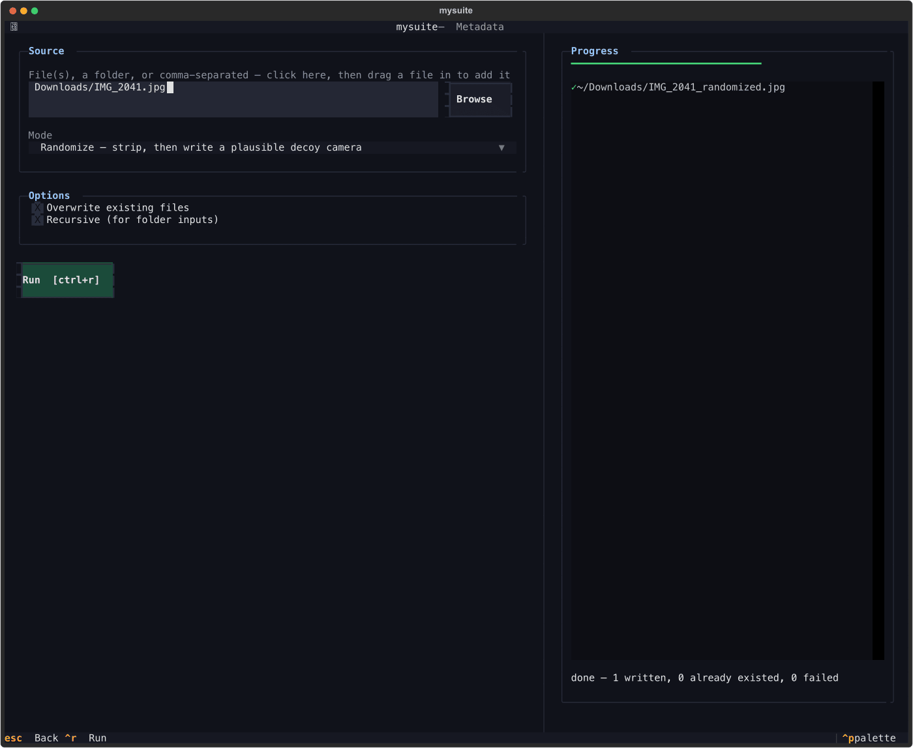<br>**Metadata** — strip, randomize or credit | 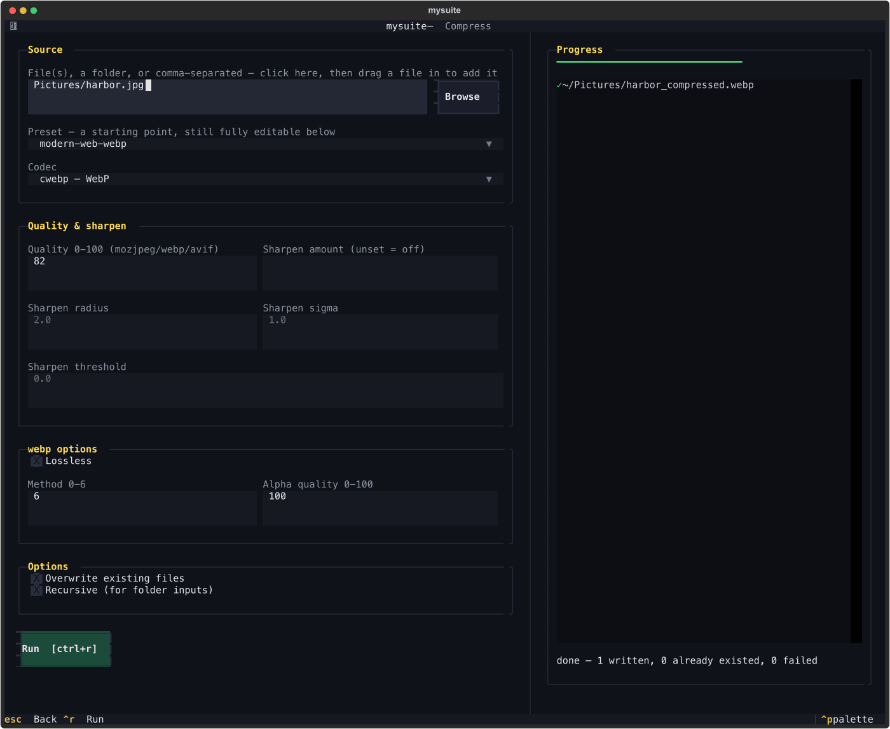<br>**Compress** — preset, codec options, result |
| 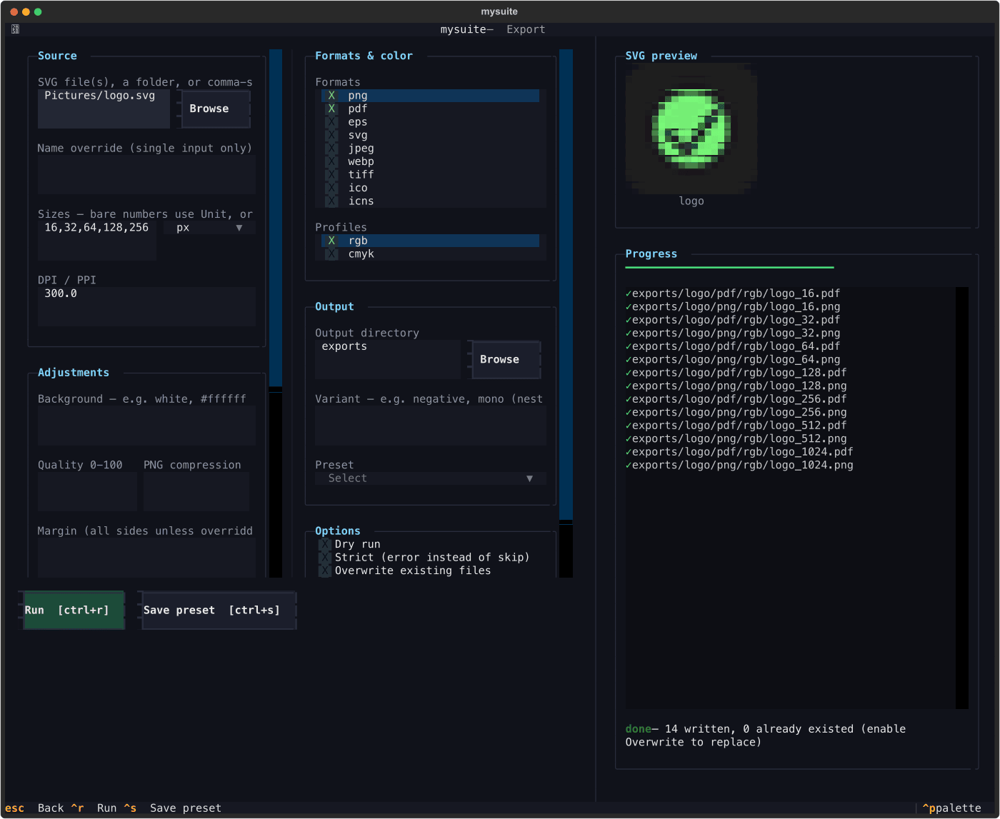<br>**Export** — one SVG to many sizes and formats | 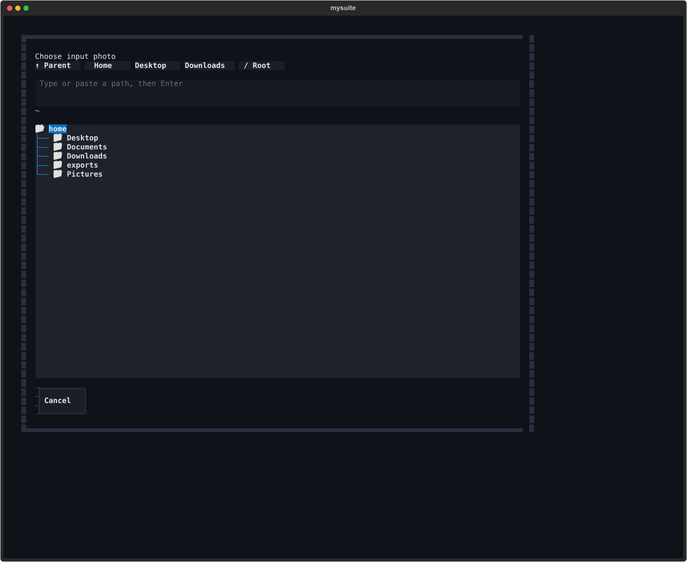<br>**File picker** — jumps, paste-a-path, hidden files off |
| 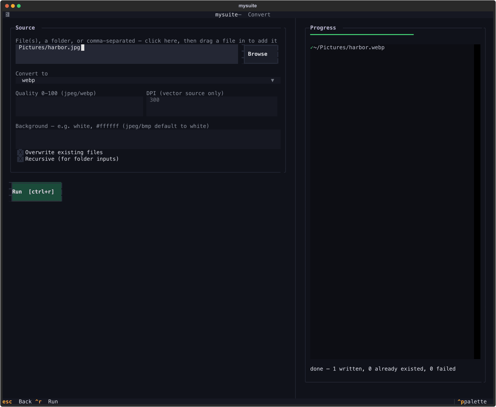<br>**Convert** | 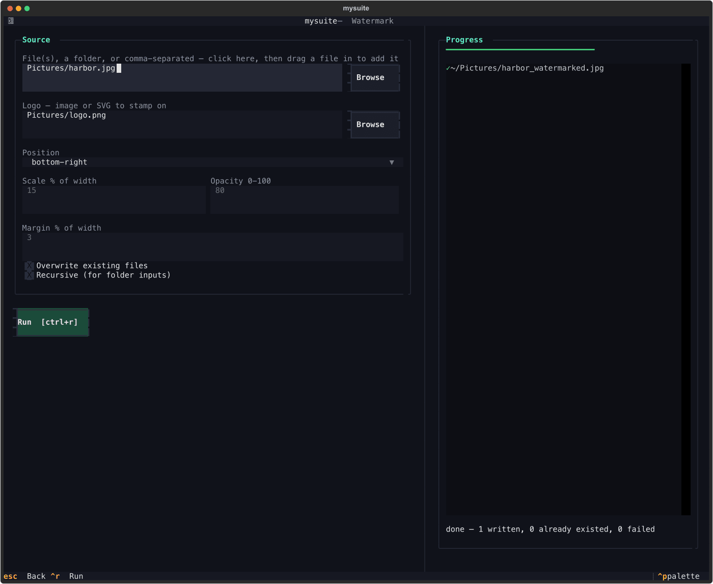<br>**Watermark** |
| 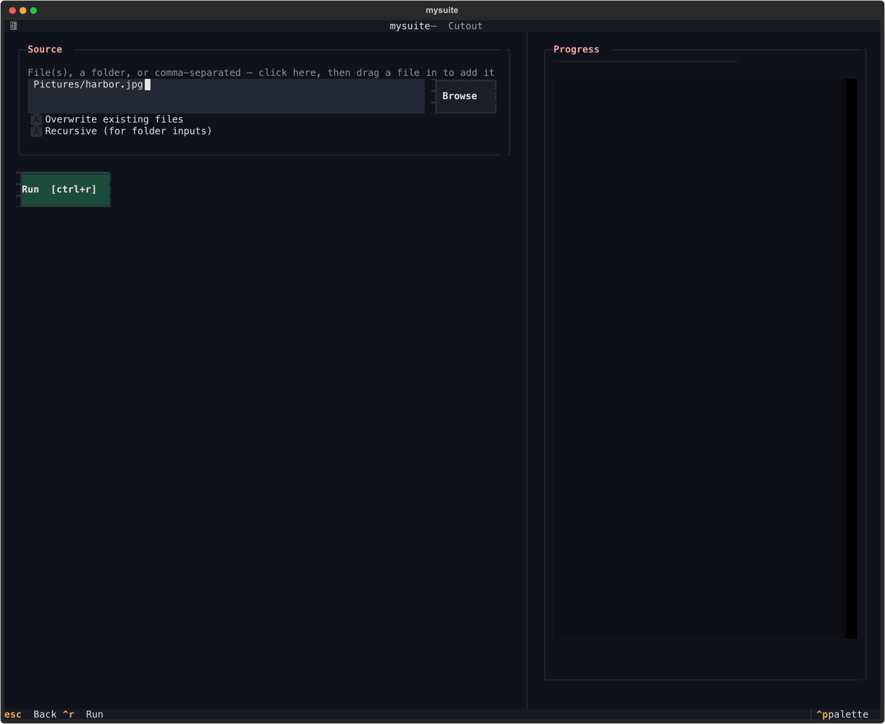<br>**Cutout** (macOS) | |

## Setup

```bash
brew install librsvg imagemagick ghostscript exiftool c2patool python@3.11
brew install mozjpeg webp libavif oxipng pngquant gifsicle   # compress tool's codecs

git clone https://github.com/fsgiven/mysuite.git && cd mysuite
/opt/homebrew/bin/python3.11 -m venv .venv
source .venv/bin/activate
pip install ".[dev]"

mysuite doctor      # checks every external tool is found
mysuite tui         # launch the terminal dashboard
```

(Without activating the venv, call `.venv/bin/mysuite` instead of `mysuite` in the examples below.)

`mysuite cutout` needs one more tool, `mysuite-cutout` — a small helper built from source (it's
mysuite-specific, not brew-installable) that wraps macOS's Vision framework
(`VNGenerateForegroundInstanceMaskRequest`, the same on-device subject-isolation tech behind
Preview/Photos "Copy Subject"). Requires macOS 14+ and the Xcode Command Line Tools
(`xcode-select --install` if you don't already have them):

```bash
mysuite/native/cutout/build.sh /opt/homebrew/bin   # builds and installs onto PATH in one step
```

`mozjpeg` is keg-only (Homebrew won't link it onto PATH — it would shadow the `cjpeg` that ships
with plain `jpeg-turbo`), so `mysuite compress --codec mozjpeg` points at mozjpeg's keg path
directly (`/opt/homebrew/opt/mozjpeg/bin/cjpeg`) rather than relying on PATH; no extra linking step
needed. On Intel Macs or Linux, set `cjpeg` under `[tools]` in `mysuite.toml` to wherever yours lives.

### Troubleshooting: `pip install -e .` fails with `ModuleNotFoundError`

Use a plain `pip install .` as above, not an editable (`-e`) install. On some Macs, files `pip` writes
get tagged with macOS's provenance-tracking flag, which also marks them hidden — Python's `site.py`
silently skips hidden `.pth` files, which is exactly what editable installs rely on. The tradeoff: after
changing code under `mysuite/`, re-run `pip install .` before using the `mysuite` command again
(`pytest` doesn't need this — it imports the live source directly).

### Security

mysuite hands your files to exiftool, ImageMagick, Ghostscript and similar tools, so only run it on
files and folders you trust, and keep those tools updated. See [SECURITY.md](SECURITY.md) for how to
report a vulnerability.

## Usage

```bash
mysuite export logo.svg \
  --sizes 16,32,64,128,256,512,1024 \
  --formats png,pdf,eps,svg \
  --profiles rgb,cmyk \
  --out ./exports
```

Supported formats: `png`, `pdf`, `eps`, `svg`, `jpeg`, `webp`, `tiff`, `ico`, `icns`. `ico` and
`icns` are *bundles* — all requested sizes are packed into a single `.ico`/`.icns` file rather than
one file per size (`icns` always builds the full standard macOS iconset — 16 through 1024px —
regardless of `--sizes`, since Apple's `iconutil` requires that exact set). `icns` needs macOS's
built-in `iconutil`, which isn't installed by the `brew` step above (it's already on any Mac).

Extra controls:

```bash
mysuite export logo.svg --formats jpeg \
  --background white --quality 85 --padding 10% --png-compression 9
```

- `--background <color>` — flattens transparency onto a solid color (e.g. `white`, `#336699`) for
  formats without a native transparency, before writing. JPEG defaults to white automatically if
  you don't set this (JPEG can't hold alpha at all); everything else stays transparent unless asked.
- `--quality 0-100` — JPEG/WebP compression quality.
- `--margin <px|%>` (alias `--padding`) — safe-space whitespace added around the artwork (e.g.
  `20px` or `10%` of each size). No background color is forced — the margin stays transparent
  unless `--background` is also set. Raster formats only (png/jpeg/webp/tiff/ico/icns) — vector
  formats are unaffected. Override a single side with `--margin-top`/`--margin-right`/
  `--margin-bottom`/`--margin-left`, e.g. `--margin 10% --margin-top 5px` uses 5px on top and 10%
  everywhere else.
- `--png-compression 0-9` — PNG zlib compression level. Lossless either way, just trades encode
  time for file size.

Sizes can also be given in physical units — `mm`, `cm`, or `in` — alongside plain pixel numbers,
converted to pixels via `--dpi`/`--ppi` (default 300, both flags are the same thing):

```bash
mysuite export logo.svg --sizes 16,32,5cm,2in --dpi 300 --formats pdf,png
```

Filenames use the size exactly as you typed it (`logo_5cm.pdf`), not the resolved pixel count —
use the `{size_px}` naming-template token instead of `{size}` if you'd rather see pixels in
filenames. DPI only affects raster output (PNG) and the pixel-equivalent used for sorting; PDF/EPS
pages are sized in real physical units regardless of DPI.

If you're mostly working in one unit, set a default instead of typing the suffix every time:

```bash
mysuite export logo.svg --sizes 50,80 --unit mm    # same as --sizes 50mm,80mm
```

`--unit` (px/mm/cm/in, also configurable as `default_unit` in `mysuite.toml`) only applies to sizes
without their own explicit suffix — `--sizes 50,80,32px --unit mm` still exports `32px` as pixels.

Preview without writing anything:

```bash
mysuite export logo.svg --dry-run
```

Only PDF, EPS, and TIFF support true CMYK — TIFF is the one *raster* format that does, unlike PNG.
Every other format (PNG, SVG, JPEG, WebP, ICO, ICNS) has no CMYK concept, so `--profiles rgb,cmyk`
combined with those formats skips the CMYK variant with a warning instead of writing a broken or
misleading file. Pass `--strict` to make that a hard error instead.

Output defaults to a format-first layout:

```
exports/<name>/<format>/<colorspace>/<name>_<size>.<ext>
```

Copy `mysuite.toml.example` to `mysuite.toml` (project dir or `~/.config/mysuite/mysuite.toml`)
to set your own defaults and `[presets.NAME]` bundles, selectable with `--preset NAME`.

## Batch input

Point `export` at multiple files and/or a folder instead of one SVG at a time — every file gets
the same flags, its own output tree named after its own filename:

```bash
mysuite export ./logos/                       # every *.svg directly inside the folder
mysuite export ./logos/ --recursive             # include subfolders too
mysuite export logo-a.svg logo-b.svg icons/     # mix explicit files and folders
```

`--name` only works with a single input file (there's no single name to give multiple outputs).
If two resolved files would produce the same output name (e.g. `brand/icon.svg` and
`social/icon.svg` both stem to `icon`), the run stops with an error up front rather than letting
one silently overwrite the other — rename one of them or process them in separate runs.

## Naming

By default the output name comes from each input file's own filename. Override it for a one-off
export (single input only — see above):

```bash
mysuite export logo.svg --name acme-brand   # exports/acme-brand/... instead of exports/logo/...
```

Add today's date to filenames so exports stay findable/sortable by when they were generated:

```bash
mysuite export logo.svg --date-stamp   # logo_512_20260819.png
```

This only changes the tool's own *default* naming templates — a `naming_template`/
`bundle_naming_template` you've already customized (in `mysuite.toml` or a preset) is left exactly
as you wrote it, since `{date}` is available as a token there too if you want to place it yourself.

## Variants & recoloring

`--variant` nests an export under the *same* name folder as the primary one, instead of getting
its own top-level folder — useful for a negative, mono, or minimal version of the same brand asset:

```bash
mysuite export logo.svg --formats png                              # exports/logo/png/...
mysuite export logo.svg --formats png --variant negative           # exports/logo/negative/png/...
```

`--recolor FROM=TO` (repeatable) swaps an exact hex color in the SVG source before rendering —
handy for producing that negative/mono variant, or for nudging what a CMYK conversion produces.
Each occurrence can itself hold several `FROM=TO` pairs, separated by commas and/or spaces in any
mix, so these two invocations are equivalent:

```bash
mysuite export logo.svg --variant negative \
  --recolor "#2b6cb0=#000000" --recolor "#f6ad55=#ffffff"

mysuite export logo.svg --variant negative \
  --recolor "#2b6cb0=#000000 #f6ad55=#ffffff"
```

The TUI's single Recolor field works the same way — type `#2b6cb0=#000000 #f6ad55=#ffffff`,
space- or comma-separated, into one box.

This is a literal `#hex` text substitution, not full SVG/CSS color parsing — it matches
`fill="#hex"`/`style="fill:#hex"`/`<style>` blocks written as exact hex tokens, not named colors
(`red`) or `rgb()`/`hsl()` functional notation. It only ever touches the temporary copy used for
rendering — your source SVG is never modified. Save a recurring brand colorset as a preset so you
don't retype it:

```bash
mysuite preset save acme-negative --variant negative \
  --recolor "#2b6cb0=#000000" --recolor "#f6ad55=#ffffff"
mysuite export logo.svg --preset acme-negative
```

Colours are compared **by value**, wherever SVG allows a colour (attributes, `style=""`, `<style>`
blocks, gradient stops): `#d00`, `#dd0000`, `rgb(221,0,0)`, `rgb(86.7%,0,0)`, `hsl(0,100%,43.3%)` and the
named colour are all the same colour. A colour within `--recolor-tolerance` (CIEDE2000, default 2 — about the
smallest difference you can see; 0 = exact only) also counts, so anti-aliased or slightly-off brand colours
are caught. A colour written with an alpha (`#dd0000ff`, `rgba()`) only matches a FROM that also has an alpha.
`FROM` can be hex or a name on the command line; `rgb()`/`hsl()` forms work in config files.

### CMYK: one engine for PDF, EPS and TIFF

All three formats now get their CMYK numbers from the same ICC conversion, so one brand red has the same inks
in every file (it used to differ: PDF C6 M100 Y100 K1, TIFF C0 M100 Y100 K34).

```bash
mysuite export logo.svg --formats pdf,eps,tiff --profiles cmyk                       # exact: the profile's numbers
mysuite export logo.svg --formats pdf,eps,tiff --profiles cmyk --cmyk-mode clean     # snap to multiples of 5
mysuite export logo.svg --formats pdf --profiles cmyk --cmyk-mode clean:10            # coarser
mysuite export logo.svg --formats pdf --profiles cmyk --cmyk-profile FOGRA39.icc      # your printer's profile
```

- `exact` keeps the profile's numbers; `clean[:N]` snaps every channel to the nearest multiple of N (default 5,
  so 73/92 becomes 75/90; ≤3 becomes 0 and ≥97 becomes 100). The export prints each colour's result and how far
  it moved (CIEDE2000 "dE"), so cleaning is never silent. The same settings can live in `mysuite.toml` as
  `cmyk_mode` and `cmyk_profile`.
- Greys are always **black ink only** (no "rich" 69/66/65/72 mixes), with the K that best matches the grey in
  the profile. Pure black is 0/0/0/100.
- The PDF declares the profile as its **output intent**, so a print shop knows what the numbers mean.
- Limits: gradients, images and transparency groups are converted by Ghostscript with the same profile but are
  not snapped to `clean` values (the export tells you when that happened); ink values in the PDF can wobble by
  about 0.1 % (Ghostscript prints 70 as 69.9); a CMYK TIFF can't hold transparency, so it is flattened on white
  unless you pass `--background`; spot colours are not supported.

## Presets

Two ready-made presets work even without a `mysuite.toml`:

```bash
mysuite export logo.svg --preset favicon      # favicon.ico (16/32/48) + individual PNGs
mysuite export logo.svg --preset macos-icon    # a complete .icns app icon
```

Save your own from any combination of export flags — this writes (or updates) a `[presets.NAME]`
block in `mysuite.toml`, preserving everything else already in the file:

```bash
mysuite preset save mybrand --sizes 24,48,5cm --formats png,webp --quality 88 --background white
mysuite preset list
mysuite export logo.svg --preset mybrand
```

A same-named preset in your own `mysuite.toml` overrides the built-in one.

## Convert

A general-purpose "duplicate and convert" tool — separate from `export`, which is SVG-specific and
size/branding-focused. `convert` takes SVG, PDF, EPS, or common raster formats and writes the result
**beside the source** (same folder, same stem, new extension) rather than into a chosen output
directory:

```bash
mysuite convert logo.svg --to png,pdf,webp       # logo.png, logo.pdf, logo.webp next to logo.svg
mysuite convert scan.pdf --to png --dpi 150
mysuite convert photo.jpg --to webp --quality 80
```

Supported targets: `png`, `jpeg`, `webp`, `tiff`, `bmp`, `gif`, `pdf`, `eps`, `ico`. SVG is
input-only (vectorization is a different problem this tool doesn't attempt), and `icns` stays
`export`'s job (a fixed 7-size Apple iconset bundle, not a one-file-in/one-file-out conversion).
`--quality`/`--dpi`/`--background` mean the same thing as `export`'s equivalents; `--dpi` only
matters when rasterizing a vector source. `--overwrite`/`--recursive`/`--dry-run`/`--config` work
the same way as `export` too.

## Cutout

Isolates a photo's subject and writes a transparent-background PNG, using macOS's on-device Vision
framework (`VNGenerateForegroundInstanceMaskRequest` — the same tech behind Preview/Photos/Safari's
"Copy Subject"). Needs the `mysuite-cutout` helper built separately — see Setup above.

```bash
mysuite cutout photo.jpg              # writes photo_cutout.png beside it
mysuite cutout ./product-photos/ --recursive --overwrite
```

Output is always PNG (transparency needs an alpha channel) with a `_cutout` suffix, so it never
collides with the source regardless of its original format. SVG/PDF/EPS sources are rasterized
first (same rsvg-convert/Ghostscript pipeline `export`/`convert` already use) before being handed to
Vision. `--overwrite`/`--recursive`/`--dry-run`/`--config` work the same way as `export`/`convert`.
This does one thing — general subject isolation, no per-instance selection or replacement
background yet — matching everyday "clean this product photo up" use.

## Watermark

Stamps a logo onto image(s) as a visible, scalable watermark — pure ImageMagick compositing, no new
dependency:

```bash
mysuite watermark photo.jpg --logo brand-mark.png
mysuite watermark ./gallery/ --logo brand-mark.svg --position top-left --scale 20 --opacity 60
```

Writes `photo_watermarked.jpg` beside the source (raster sources keep their original extension;
`svg`/`pdf`/`eps` sources become `.png`, since watermarking is a raster compositing step). The logo
is resized to `--scale`% of the base image's width (default 15%) before compositing, so it scales
sensibly across output sizes rather than staying a fixed pixel size — and can itself be an SVG,
rasterized the same way as elsewhere in the suite. `--position` is one of the 9-point grid:
`top-left`, `top-center`, `top-right`, `center-left`, `center`, `center-right`, `bottom-left`,
`bottom-center`, `bottom-right` (default `bottom-right`). `--opacity` (default 80) and `--margin`
(breathing room from the edge, % of width, default 3) round it out.
`--overwrite`/`--recursive`/`--dry-run`/`--config` work the same way as the other tools.

## Metadata

Three modes in one command group — remove everything for privacy, replace it with a believable
decoy, or embed a signed provenance record for correct crediting (the same C2PA Content Credentials
standard Adobe, OpenAI and Google use on AI-generated images):

```bash
mysuite metadata strip photo.jpg                                    # photo_stripped.jpg
mysuite metadata randomize photo.jpg                                # photo_randomized.jpg
mysuite metadata credit photo.jpg --author "Jane Doe" --copyright "© 2026 Jane Doe"
```

**`strip`** removes EXIF, IPTC, XMP, ICC profiles, GPS, maker notes, embedded thumbnails and JPEG
comments via `exiftool -all=`, writing a new file — the source is never touched. Two details handled
for you: the **Orientation** flag is kept (it's just a 1-8 rotation hint with nothing identifying, and
dropping it leaves phone photos sideways), and **TIFFs** get an extra `magick -strip` pass because
exiftool can't delete a TIFF's main metadata block (Artist/Copyright/Software would otherwise
survive). Because the output is a new file, macOS extended attributes on the original — the
quarantine flag and the "downloaded from" URL — don't carry over either. One thing no tool can
remove: macOS stamps an empty `com.apple.provenance` flag on files written by some processes; it
carries no information.

`strip` verified clean against a JPEG, PNG, WebP and TIFF seeded with EXIF, GPS, IPTC, XMP, comments,
serial numbers, a Photoshop-style software string and a hostname — nothing identifying remained in
the tags or in the raw file bytes. It does not remove a C2PA manifest embedded by an earlier `credit`
run (a separate segment exiftool doesn't own). If the source used a non-sRGB color profile, stripping
the profile can shift how colors render.

**`randomize`** strips everything the same way, then writes **one internally consistent decoy camera**:
a real device's make, model, lens and firmware string taken together (a Nikon body with a Nikkor
lens, an iPhone with its real lens description, a Samsung with no lens string like the real thing),
plus per-photo values drawn from that device's valid ranges (aperture the lens can actually do, ISO
the sensor offers, exposure time, focal length, and a plausible daytime capture date within the last
18 months). Seven profiles ship in `mysuite/metadata/camera_profiles.py` — edit or extend the list.
It **never writes GPS**, and nothing from the original survives. Be realistic about what this is: it
hides the real capture device in the metadata. It does not defeat image forensics — sensor-noise
patterns, and the thumbnails and maker-note structure a genuine camera file would carry, are not
reproduced.

**`credit`** shells out to `c2patool`, embedding a signed manifest with `--author`
(required), `--copyright` (optional), and `--generator` (defaults to `mysuite`). It signs with
c2patool's **built-in test certificate** — real enough to embed and read back a provenance record
for personal/internal verification (`c2patool photo_credited.jpg` reads it back), but **not
third-party-trusted** — that needs a certificate from an accredited CA, which is your own separate
step if you ever want one, not something this tool obtains for you.

`--overwrite`/`--recursive`/`--dry-run`/`--config` work the same way as the other tools, applied
per-subcommand (`mysuite metadata strip --dry-run ...`).

## Compress

Re-encodes image(s) via the same best-in-class, specialized codecs Squoosh.app itself uses under the
hood — not ImageMagick's generic writers — with full per-codec parameter control, plus an optional
unsharp-mask sharpen pass applied before encoding:

```bash
mysuite compress photo.png --codec mozjpeg --quality 85
mysuite compress ./gallery/ --codec webp --quality 80 --method 6 --sharpen-amount 1.2
mysuite compress icon.png --codec oxipng --effort 6
```

Writes `photo_compressed.<ext>` beside the source. `--codec` picks the encoder (each a distinct,
real tool, not a generic fallback):

| codec | tool | good for |
| --- | --- | --- |
| `mozjpeg` | `cjpeg` | JPEG photos — meaningfully smaller than ImageMagick's own JPEG writer at the same visual quality |
| `webp` | `cwebp` | modern lossy/lossless web images |
| `avif` | `avifenc` | best compression ratio of the bunch, slower to encode |
| `oxipng` | `oxipng` | lossless PNG re-optimization (no visual change) |
| `pngquant` | `pngquant` | lossy PNG — quantizes to a palette for a much smaller file |
| `gifsicle` | `gifsicle` | GIF optimization |

`--quality` (0-100) applies to mozjpeg/webp/avif; pngquant uses its own `--quality-range` (e.g.
`65-90`) instead, since it quantizes to a range rather than a single target. Each codec exposes its
own real parameters — `--progressive`/`--subsample` (mozjpeg), `--lossless`/`--method`/
`--alpha-quality` (webp), `--speed` (avif), `--effort`/`--interlace` (oxipng), `--speed`/`--dither`
(pngquant, via `--pngquant-speed`), `--optimize-level`/`--lossy` (gifsicle) — see `--help` for the
full list. A source that isn't in the format its chosen encoder needs natively (mozjpeg's `cjpeg`
only ever accepts uncompressed PPM, for instance) is converted first via `magick`, the same
rasterize-then-convert pattern used throughout the suite for vector sources.

`--sharpen-amount` (unset by default = no sharpening) applies an ImageMagick unsharp mask
(`--sharpen-radius`/`--sharpen-sigma`/`--sharpen-threshold` round out full control over it) before
handing off to the codec — resize is deliberately out of scope here, Export/Convert already own
that.
`--overwrite`/`--recursive`/`--dry-run`/`--config` work the same way as the other tools.

## Enhance

Upscales and restores photos entirely on your machine — no uploads, no credits, no watermark. A
classical pipeline (Pillow + NumPy) always works with zero extra setup; an optional neural backend
adds real AI upscaling and face restoration.

```bash
mysuite enhance run photo.jpg                          # gentle preset: 2x -> photo_enhanced.png
mysuite enhance run ./scans/ --preset old-photo        # denoise + color + scratch removal
mysuite enhance run photo.jpg --preset prime --scale 3 --format jpg --quality 92
mysuite enhance presets                                # list presets + whether the AI backend is installed
```

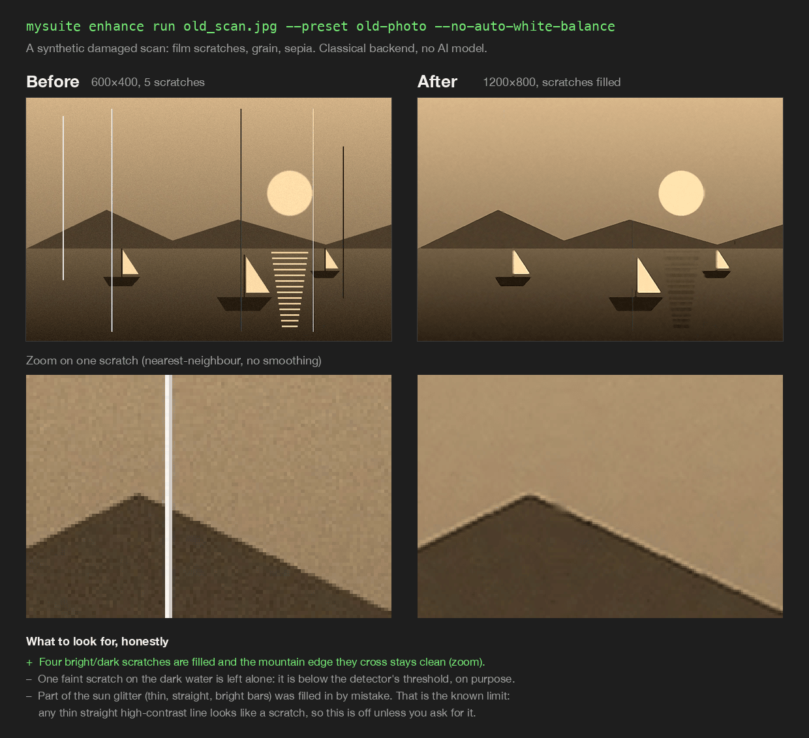

The figure is made from a **synthetic** image and shows the misses as well as the fix: one faint scratch
was left alone and part of the sun glitter was filled in by mistake.

Writes `photo_enhanced.<ext>` beside the source (never touches the original); `--overwrite`,
`--recursive`, `--dry-run`, `--config` and `--quiet` work like the other tools. Presets (`prime`,
`gentle`, `old-photo`, `ai-art`, `portrait`) are starting points: any flag you also pass overrides that
field, and you can add your own under `[enhance_presets.NAME]` in `mysuite.toml`.
Fields: `--scale 1-8`, `--denoise`/`--sharpen` (0-1), `--saturation`/`--contrast`/`--gamma`,
`--auto-white-balance`, `--face-enhance`, `--restore-scratches`, `--format png|jpg|webp`, `--quality`.

Pipeline order: scratch removal (at native resolution, where thin lines are crispest) → upscale +
denoise + sharpen → color (white balance, saturation, contrast) → gamma.

**Handled for you:** EXIF rotation is applied to the pixels, since the output carries no EXIF and a
rotation flag would be lost; wide-gamut sources (Display P3, Adobe RGB) are converted to sRGB instead
of being tagged-then-stripped, which would wash the colors out; transparency is kept for PNG/WebP and
flattened to white for JPEG. **The output has no metadata at all** — no EXIF, XMP or color profile.

**Honest about its limits**
- The classical backend is Lanczos resampling plus an unsharp mask. It makes a sharper, cleaner large
  image, but it cannot invent detail the way a neural upscaler does — expect a clear difference from
  services like Let's Enhance on small, soft sources.
- **Face enhancement does nothing without the AI backend**, and says so in the output rather than
  silently skipping it. The `prime`, `old-photo` and `portrait` presets turn it on.
- **Scratch removal** (`--restore-scratches`, on in `old-photo` only) fills thin, straight, high-contrast
  lines from their clean surroundings; nothing else is touched. It was tuned on real photos so it
  doesn't fire on door frames or hair, which means **faint scratches (below roughly +30 luminance) and
  short ones (under 25px) are left alone**. It isn't generative inpainting: torn or wide damage stays,
  and a real power line or railing can be partly filled in, so leave it off for ordinary photos.
- Output is capped at 250 megapixels; a larger result needs a smaller `--scale`.

**Optional AI backend (Real-ESRGAN upscaling, GFPGAN faces).** Not installed by default — it pulls in
PyTorch (hundreds of MB). To enable it:

```bash
pip install ".[ai]"
mkdir -p ~/.cache/mysuite/models     # or set MYSUITE_CACHE_DIR
# download RealESRGAN_x4plus.pth (Real-ESRGAN releases) and GFPGANv1.4.pth (GFPGAN releases) into it
mysuite enhance presets              # should now report the AI backend as available
```

`--backend auto` (the default) uses it when present and falls back to classical otherwise;
`--backend realesrgan` fails clearly if it's missing. This path is ported from a standalone prototype
and has **not** been exercised against real model weights yet.

**Job history is off by default.** `--record-history` logs each job (paths, sizes, timing) to a local
SQLite file (`~/.local/share/mysuite/enhance-history.db`, or `MYSUITE_DATA_DIR`) so
`mysuite enhance history` can list it and `--clear` can delete it. It's opt-in because a log of
which files you processed is itself a trace.

## Terminal dashboard

```bash
mysuite tui
```

Opens an interactive home screen listing the available tools — **Export**, **Convert**, **Cutout**,
**Watermark**, **Metadata**, **Compress**, **Enhance** today, each with its own accent color so it's obvious
which one you're in; more (`palette`, `sort`) will show up here as they're added, no navigation
changes needed. Press a number key to jump straight to a tool, or arrow keys + Enter. The Export
screen mirrors every CLI flag as a two-column form, fields grouped into titled panels (Source,
Adjustments, Formats & color, Output, Options) rather than one long list — including a **Unit**
dropdown (px/mm/cm/in) right next to Sizes, so bare numbers use whatever unit you've picked without
typing the suffix every time, and a **Recolor** section with dedicated FROM/TO fields per swap (hex
or CSS color names) plus +/− buttons, rather than one syntax-heavy text field. Convert/Cutout/
Watermark use the same form/run shape, scaled down to what each actually needs (no
sizes/formats/quality concepts for Cutout, for instance); Metadata adds a **Mode** toggle
(Strip/Randomize/Credit) that shows or hides the Author/Copyright/Generator fields depending which mode is
selected; Compress adds a **Codec** dropdown that shows only the six mozjpeg/webp/avif/oxipng/
pngquant/gifsicle option groups relevant to whichever codec is selected.
Keyboard shortcuts are shown in the footer: **Ctrl+R** run, **Ctrl+S** save the
current Export form as a named preset (writes into `mysuite.toml` right from the TUI, no editing by
hand). Every screen's input field also takes a folder, a comma-separated list of files, or a file
dragged straight onto the terminal window (most terminals turn an OS file-drop into a paste of its
path). Every **Browse**
button opens a picker rooted at the filesystem root (`/`), not the project folder, so any file
anywhere on disk is reachable by drilling down. The equivalent CLI commands keep working unchanged
for scripting — the TUI is additive, not a replacement.

## Tests

```bash
pip install ".[dev]"
pytest                 # everything that can run on this machine
pytest -m "not slow"   # skips the tests that call real external tools (exiftool, ImageMagick, codecs)
```

The suite covers every tool, the file picker, path
handling and the dashboard screens. Known bugs are pinned with `xfail(strict=True)` and listed in
[docs/TEST-FINDINGS.md](docs/TEST-FINDINGS.md); see also [Status](#status-what-is-and-isnt-tested). Tests that
need an external tool skip with a reason when it isn't installed, rather than failing.

## License

MIT — see [LICENSE](LICENSE).
